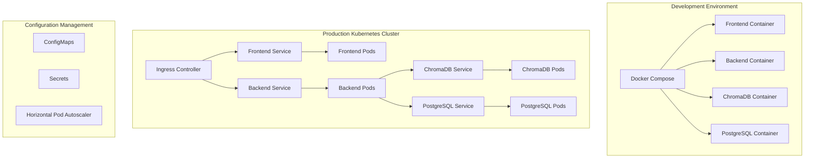

# Design Document

## Overview

This design implements a comprehensive containerization and orchestration strategy for GoalTrajectory.AI, transforming the current basic Docker setup into an industry-standard deployment architecture. The solution provides multi-stage Dockerfiles, enhanced Docker Compose configurations, complete Kubernetes manifests, and production-ready configurations that mirror enterprise-grade deployments.

## Architecture

### Container Architecture



### Multi-Stage Build Strategy

Each service will use optimized multi-stage builds:

1. **Build Stage**: Install dependencies, compile assets
2. **Production Stage**: Copy only runtime artifacts, use minimal base images
3. **Security**: Non-root users, minimal attack surface

## Components and Interfaces

### 1. Backend Dockerfile

**Multi-stage Python container:**
- Build stage: Python 3.11-slim with build tools
- Production stage: Python 3.11-slim with runtime only
- Security: Non-root user, minimal packages
- Optimization: Layer caching, dependency separation

### 2. Frontend Dockerfile

**Multi-stage Next.js container:**
- Build stage: Node.js 18 with build dependencies
- Production stage: Node.js 18-alpine with runtime only
- Static optimization: Next.js static export when possible
- Security: Non-root user, minimal attack surface

### 3. Enhanced Docker Compose

**Development and production configurations:**
- `docker-compose.yml`: Base configuration
- `docker-compose.dev.yml`: Development overrides (hot reload, debug)
- `docker-compose.prod.yml`: Production overrides (optimized builds)
- Health checks and proper service dependencies

### 4. Kubernetes Manifests

**Complete K8s deployment structure:**
```
k8s/
├── base/
│   ├── namespace.yaml
│   ├── configmap.yaml
│   ├── secrets.yaml
│   └── network-policies.yaml
├── backend/
│   ├── deployment.yaml
│   ├── service.yaml
│   └── hpa.yaml
├── frontend/
│   ├── deployment.yaml
│   ├── service.yaml
│   └── hpa.yaml
├── chromadb/
│   ├── deployment.yaml
│   ├── service.yaml
│   └── pvc.yaml
└── ingress/
    └── ingress.yaml
```

## Data Models

### Configuration Management

**Environment-specific configurations:**
```yaml
# ConfigMap structure
apiVersion: v1
kind: ConfigMap
metadata:
  name: app-config
data:
  ENVIRONMENT: "production"
  CHROMA_HOST: "chromadb-service"
  CHROMA_PORT: "8000"
  LOG_LEVEL: "INFO"
```

**Secret management:**
```yaml
# Secret structure
apiVersion: v1
kind: Secret
metadata:
  name: app-secrets
type: Opaque
data:
  SUPABASE_SERVICE_ROLE_KEY: <base64-encoded>
  GEMINI_API_KEY: <base64-encoded>
  OPENROUTER_API_KEY: <base64-encoded>
```

### Resource Specifications

**Environment-specific resource limits:**
- **Development**: Minimal resources, focus on functionality
- **Staging**: Production-like resources for testing
- **Production**: Optimized resources with autoscaling

## Error Handling

### Container Health Checks

**Readiness and Liveness Probes:**
- Backend: HTTP health endpoint `/health`
- Frontend: HTTP check on port 3000
- ChromaDB: HTTP check on port 8000
- Failure thresholds and recovery strategies

### Kubernetes Error Recovery

**Automatic recovery mechanisms:**
- Pod restart policies for transient failures
- Horizontal Pod Autoscaler for load management
- Resource quotas to prevent resource exhaustion
- Network policies for security isolation

### Monitoring and Alerting

**Observability integration:**
- Prometheus metrics endpoints
- Structured logging with JSON format
- Health check endpoints for all services
- Resource usage monitoring

## Testing Strategy

### Container Testing

**Multi-level testing approach:**
1. **Unit Tests**: Run inside containers during build
2. **Integration Tests**: Docker Compose test environment
3. **Security Tests**: Container vulnerability scanning
4. **Performance Tests**: Resource usage and startup time

### Kubernetes Testing

**Deployment validation:**
1. **Manifest Validation**: YAML syntax and Kubernetes API validation
2. **Deployment Tests**: Automated deployment to test cluster
3. **Health Check Validation**: Verify all probes work correctly
4. **Network Tests**: Service discovery and communication

### Environment Parity

**Development-Production consistency:**
- Same base images across environments
- Environment-specific configuration only
- Automated testing of production configurations
- Container image promotion pipeline

## Security Considerations

### Container Security

**Security best practices:**
- Non-root users in all containers
- Minimal base images (Alpine/Distroless)
- Regular security scanning
- Read-only root filesystems where possible

### Kubernetes Security

**Cluster security measures:**
- Network policies for service isolation
- Pod Security Standards enforcement
- RBAC for service accounts
- Secret management with encryption at rest

### Image Security

**Supply chain security:**
- Multi-stage builds to minimize attack surface
- Dependency vulnerability scanning
- Image signing and verification
- Regular base image updates

## Performance Optimization

### Build Optimization

**Efficient container builds:**
- Layer caching strategies
- Dependency pre-installation
- Multi-stage build optimization
- Build context minimization

### Runtime Optimization

**Production performance:**
- Resource limits and requests tuning
- Horizontal Pod Autoscaling configuration
- Persistent volume optimization
- Network performance tuning

### Scaling Strategy

**Horizontal scaling approach:**
- Stateless application design
- Database connection pooling
- Shared storage for stateful components
- Load balancing configuration