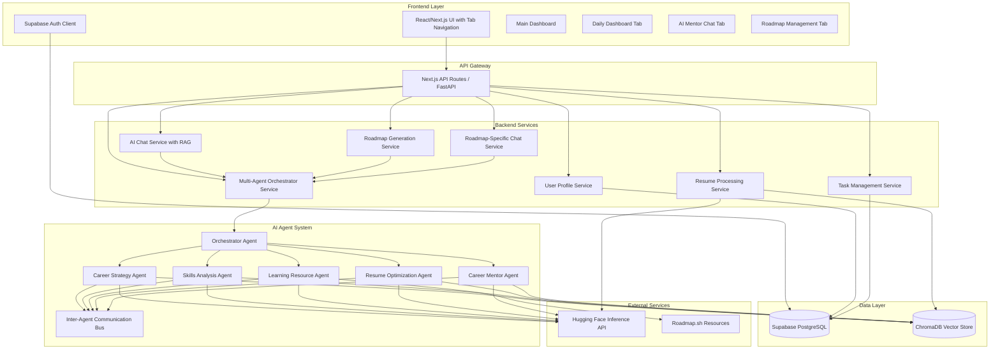

# Design Document

## Overview

Trajectory.AI is designed as a modern, scalable career navigation platform built with a microservices architecture. The system combines a React/Next.js frontend with a containerized backend that leverages AI/ML technologies for personalized career guidance. The platform uses a hybrid approach with Supabase for user data and authentication, ChromaDB for vector storage, and Hugging Face models for AI processing.

## Architecture

### High-Level Architecture



### Technology Stack

- **Frontend**: React 18 + Next.js 14 + Tailwind CSS
- **Backend**: FastAPI (Python) for AI/ML services, Next.js API routes for simple operations
- **Database**: Supabase (PostgreSQL) for relational data
- **Vector Database**: ChromaDB for embeddings and semantic search
- **Authentication**: Supabase Auth
- **AI/ML**: Hugging Face Inference API (Mistral-7B, Gemma, bge-small-en-v1.5)
- **Orchestration**: LangChain for AI workflow management
- **Containerization**: Docker + Kubernetes
- **Deployment**: Vercel (frontend), GKE/Minikube (backend services)

## Components and Interfaces

### Frontend Components

#### 1. Authentication Flow
- **LoginPage**: Supabase email/password authentication
- **SignupPage**: User registration with email verification
- **AuthGuard**: Route protection component

#### 2. Onboarding Flow
- **ProfileSetupForm**: Collects education, career background, and goals
- **ResumeUploadComponent**: PDF upload with drag-and-drop interface
- **OnboardingWizard**: Multi-step guided setup process

#### 3. Main Application
- **Dashboard**: Primary interface with overview and quick actions (without Activity Summary)
- **DailyDashboard**: Separate tab with calendar, to-do lists, and notes
- **AIMentorChat**: Dedicated tab for AI mentor conversations with RAG integration
- **RoadmapInterface**: Separate tab with sidebar for roadmap history and main display area
- **RoadmapChat**: Context-aware chat for specific roadmap questions and edits
- **ProfileEditor**: Edit user information and re-upload resume

#### 4. Navigation and Layout Components
- **TabNavigation**: Main navigation with Dashboard, Daily Dashboard, AI Mentor, and Roadmaps tabs
- **RoadmapSidebar**: Collapsible sidebar showing roadmap history with titles and creation dates
- **PersonalizedHeader**: Header component displaying "Welcome, [User's Name]" with user menu
- **EmptyStateMessage**: Reusable component for meaningful empty states in to-do lists and roadmap history

#### 5. Enhanced Dashboard Components
- **TaskManager**: Component for displaying and managing career to-do items with empty state handling
- **RoadmapHistoryList**: Sidebar component for roadmap selection and management
- **RoadmapDisplayArea**: Main content area for showing selected roadmap details
- **InlineRoadmapChat**: Chat component embedded within roadmap view for contextual assistance

#### 6. Shared Components
- **LoadingSpinner**: Consistent loading states
- **ErrorBoundary**: Error handling and user feedback
- **NavigationBar**: App navigation with user menu

### Backend Services

#### 1. User Profile Service
```python
class UserProfileService:
    def create_profile(user_id: str, profile_data: dict) -> Profile
    def get_profile(user_id: str) -> Profile
    def update_profile(user_id: str, updates: dict) -> Profile
    def delete_profile(user_id: str) -> bool
```

#### 2. Resume Processing Service
```python
class ResumeProcessingService:
    def upload_resume(user_id: str, file: bytes) -> str
    def parse_resume(file_path: str) -> dict
    def create_embeddings(text_chunks: list) -> list
    def store_embeddings(user_id: str, embeddings: list) -> bool
```

#### 3. AI Chat Service
```python
class AIChatService:
    def initialize_chat(user_id: str) -> ChatSession
    def send_message(session_id: str, message: str) -> str
    def get_chat_history(session_id: str) -> list
    def get_user_context(user_id: str) -> dict
```

#### 4. Roadmap Generation Service
```python
class RoadmapService:
    def generate_roadmap(user_id: str, current_role: str, target_role: str) -> Roadmap
    def get_learning_resources(skills: list) -> list
    def update_roadmap(roadmap_id: str, updates: dict) -> Roadmap
    def get_roadmap_progress(user_id: str) -> dict
    def get_user_roadmaps(user_id: str) -> list[Roadmap]
    def get_roadmap_by_id(roadmap_id: str) -> Roadmap
```

#### 5. Roadmap Chat Service
```python
class RoadmapChatService:
    def initialize_roadmap_chat(roadmap_id: str) -> RoadmapChatSession
    def send_roadmap_message(session_id: str, message: str) -> str
    def update_roadmap_from_chat(roadmap_id: str, updates: dict) -> Roadmap
    def get_roadmap_context(roadmap_id: str) -> dict
```

#### 6. Task Management Service
```python
class TaskService:
    def create_task(user_id: str, task_data: dict) -> Task
    def get_user_tasks(user_id: str) -> list[Task]
    def update_task_status(task_id: str, status: str) -> Task
    def generate_tasks_from_roadmap(roadmap_id: str) -> list[Task]
    def delete_task(task_id: str) -> bool
```

#### 7. Multi-Agent Orchestrator Service
```python
class AgentOrchestratorService:
    def coordinate_agents(request_type: str, user_context: dict) -> AgentResponse
    def route_request(request: dict) -> list[str]  # Returns list of agent IDs
    def synthesize_responses(agent_responses: list[dict]) -> dict
    def manage_agent_communication(sender_id: str, message: dict) -> bool
    def get_agent_status() -> dict
```

### AI Agent System

#### 1. Orchestrator Agent
```python
class OrchestratorAgent:
    def analyze_request(user_request: str, context: dict) -> RequestAnalysis
    def determine_required_agents(analysis: RequestAnalysis) -> list[str]
    def coordinate_workflow(agents: list[str], context: dict) -> WorkflowPlan
    def synthesize_final_response(agent_outputs: list[dict]) -> dict
    def handle_conflicts(conflicting_responses: list[dict]) -> dict
```

#### 2. Career Strategy Agent
```python
class CareerStrategyAgent:
    def analyze_career_transition(current_role: str, target_role: str, user_profile: dict) -> dict
    def create_strategic_roadmap(transition_analysis: dict) -> dict
    def identify_career_opportunities(user_background: dict) -> list[dict]
    def assess_market_trends(target_role: str) -> dict
    def recommend_networking_strategies(career_goals: dict) -> list[dict]
```

#### 3. Skills Analysis Agent
```python
class SkillsAnalysisAgent:
    def analyze_current_skills(resume_content: str, profile: dict) -> dict
    def identify_skill_gaps(current_skills: dict, target_role: str) -> dict
    def prioritize_skill_development(skill_gaps: dict, timeline: str) -> list[dict]
    def assess_transferable_skills(current_role: str, target_role: str) -> dict
    def recommend_skill_validation(skills: list[str]) -> list[dict]
```

#### 4. Learning Resource Agent
```python
class LearningResourceAgent:
    def curate_learning_path(skills: list[str], learning_style: str) -> dict
    def find_courses(skill: str, difficulty: str, budget: str) -> list[dict]
    def recommend_certifications(target_role: str, current_skills: dict) -> list[dict]
    def suggest_projects(skills: list[str], experience_level: str) -> list[dict]
    def identify_mentorship_opportunities(career_goals: dict) -> list[dict]
```

#### 5. Resume Optimization Agent
```python
class ResumeOptimizationAgent:
    def analyze_resume_structure(resume_content: str) -> dict
    def suggest_content_improvements(resume: dict, target_role: str) -> list[dict]
    def optimize_keywords(resume: dict, job_descriptions: list[str]) -> dict
    def recommend_formatting_changes(resume_structure: dict) -> list[dict]
    def validate_achievements(achievements: list[str]) -> dict
```

#### 6. Career Mentor Agent
```python
class CareerMentorAgent:
    def provide_career_advice(question: str, user_context: dict) -> str
    def conduct_mock_interview(role: str, user_background: dict) -> dict
    def offer_motivation_support(user_progress: dict, challenges: list[str]) -> str
    def suggest_career_experiments(interests: list[str], constraints: dict) -> list[dict]
    def facilitate_decision_making(options: list[dict], criteria: dict) -> dict
```

#### 7. Inter-Agent Communication System
```python
class AgentCommunicationBus:
    def send_message(sender_id: str, recipient_id: str, message: dict) -> bool
    def broadcast_context_update(context: dict) -> bool
    def request_collaboration(requesting_agent: str, target_agents: list[str], task: dict) -> dict
    def share_insights(agent_id: str, insights: dict) -> bool
    def coordinate_response_timing(agents: list[str]) -> dict
```

## Data Models

### User Profile Model
```python
class Profile:
    id: str
    user_id: str  # Supabase Auth user ID
    name: str  # User's full name for personalization
    education: dict
    career_background: str
    current_role: str
    target_roles: list[str]
    additional_details: str
    created_at: datetime
    updated_at: datetime
```

### Resume Model
```python
class Resume:
    id: str
    user_id: str
    file_path: str
    parsed_content: dict
    embedding_ids: list[str]  # References to ChromaDB
    upload_date: datetime
```

### Chat Session Model
```python
class ChatSession:
    id: str
    user_id: str
    messages: list[dict]
    context_version: str  # For tracking RAG context updates
    created_at: datetime
    last_activity: datetime
```

### Roadmap Model
```python
class Roadmap:
    id: str
    user_id: str
    current_role: str
    target_role: str
    title: str  # Display title for roadmap sidebar
    phases: list[dict]
    estimated_timeline: str
    progress: dict
    created_at: datetime
    updated_at: datetime
```

### Roadmap Chat Session Model
```python
class RoadmapChatSession:
    id: str
    roadmap_id: str
    user_id: str
    messages: list[dict]
    roadmap_context: dict  # Cached roadmap content for context
    created_at: datetime
    last_activity: datetime
```

### Task Model
```python
class Task:
    id: str
    user_id: str
    roadmap_id: str  # Optional - null for manually added tasks
    title: str
    description: str
    status: str  # 'pending', 'in_progress', 'completed'
    due_date: datetime
    created_at: datetime
    updated_at: datetime
```

### Multi-Agent System Models

#### Agent Request Model
```python
class AgentRequest:
    id: str
    user_id: str
    request_type: str  # 'roadmap_generation', 'skill_analysis', 'resume_review', etc.
    content: dict
    context: dict
    priority: int
    created_at: datetime
    status: str  # 'pending', 'processing', 'completed', 'failed'
```

#### Agent Response Model
```python
class AgentResponse:
    id: str
    request_id: str
    agent_id: str
    response_content: dict
    confidence_score: float
    processing_time: float
    metadata: dict
    created_at: datetime
```

#### Agent Workflow Model
```python
class AgentWorkflow:
    id: str
    request_id: str
    orchestrator_id: str
    participating_agents: list[str]
    workflow_steps: list[dict]
    current_step: int
    status: str
    created_at: datetime
    completed_at: datetime
```

#### Agent Communication Model
```python
class AgentMessage:
    id: str
    sender_agent_id: str
    recipient_agent_id: str
    message_type: str  # 'context_share', 'collaboration_request', 'insight_share'
    content: dict
    timestamp: datetime
    acknowledged: bool
```

### ChromaDB Collections
- **resume_embeddings**: User resume content chunks
- **knowledge_base**: Scraped learning resources and career information
- **conversation_memory**: Chat context and user interaction history
- **roadmap_embeddings**: Roadmap content for context-aware roadmap chat
- **agent_knowledge**: Specialized knowledge bases for each agent type
- **agent_interactions**: Historical agent collaboration patterns and outcomes

## Error Handling

### Frontend Error Handling
- **Network Errors**: Retry mechanism with exponential backoff
- **Authentication Errors**: Automatic redirect to login with clear messaging
- **Validation Errors**: Real-time form validation with user-friendly messages
- **File Upload Errors**: Progress indicators and error recovery options

### Backend Error Handling
- **AI Service Failures**: Fallback responses and graceful degradation
- **Database Connection Issues**: Connection pooling and retry logic
- **File Processing Errors**: Detailed error logging and user notification
- **Rate Limiting**: Queue management for Hugging Face API calls

### Error Response Format
```python
class ErrorResponse:
    error_code: str
    message: str
    details: dict
    timestamp: datetime
    request_id: str
```

## Testing Strategy

### Frontend Testing
- **Unit Tests**: Jest + React Testing Library for components
- **Integration Tests**: Cypress for user flow testing
- **Visual Regression**: Chromatic for UI consistency
- **Accessibility**: axe-core for WCAG compliance

### Backend Testing
- **Unit Tests**: pytest for service logic
- **Integration Tests**: FastAPI TestClient for API endpoints
- **AI Model Tests**: Mock Hugging Face responses for consistent testing
- **Database Tests**: Test containers for isolated database testing

### End-to-End Testing
- **User Journey Tests**: Complete onboarding to roadmap generation flow
- **Performance Tests**: Load testing for AI service endpoints
- **Security Tests**: Authentication and authorization validation

### Test Data Management
- **Synthetic Data**: Generated test profiles and resumes
- **Mock AI Responses**: Consistent AI model outputs for testing
- **Database Seeding**: Automated test data setup and teardown

## Performance Considerations

### Frontend Optimization
- **Code Splitting**: Route-based and component-based lazy loading
- **Image Optimization**: Next.js automatic image optimization
- **Caching**: SWR for API response caching
- **Bundle Analysis**: Regular bundle size monitoring

### Backend Optimization
- **Connection Pooling**: Database and ChromaDB connection management
- **Caching Strategy**: Redis for frequently accessed user data
- **Async Processing**: Background jobs for resume processing and embedding generation
- **Rate Limiting**: Intelligent queuing for Hugging Face API calls

### AI/ML Optimization
- **Embedding Caching**: Store and reuse embeddings for similar queries
- **Model Selection**: Choose appropriate model size based on query complexity
- **Batch Processing**: Group similar requests for efficiency
- **Context Management**: Optimize RAG context size for performance

## User Experience Design

### Navigation Flow
- **Tab-Based Architecture**: Clean separation of concerns with dedicated tabs for Dashboard, Daily Dashboard, AI Mentor, and Roadmaps
- **Persistent State**: User progress and data maintained across tab switches
- **Contextual Actions**: Tab-specific actions and shortcuts for improved workflow
- **Responsive Design**: Mobile-first approach with collapsible sidebars and adaptive layouts

### Personalization Strategy
- **Name-Based Greeting**: Replace generic email display with personalized "Welcome, [Name]" messaging
- **Context-Aware Responses**: AI responses tailored to user's specific background and goals
- **Progressive Disclosure**: Show relevant information based on user's journey stage
- **Smart Defaults**: Pre-populate forms and suggestions based on user history

### Empty State Management
- **Encouraging Messaging**: Positive, action-oriented messages for empty states
- **Clear Next Steps**: Specific guidance on how to get started or add content
- **Visual Hierarchy**: Use of icons and typography to make empty states engaging
- **Progressive Onboarding**: Contextual tips and guidance for new features

### RAG Integration Design
- **Seamless Context**: Automatic retrieval of user context without explicit requests
- **Transparency**: Clear indication when AI is using personal data for responses
- **Fallback Handling**: Graceful degradation when RAG retrieval fails
- **Context Freshness**: Automatic updates when user profile or resume changes

## Security Considerations

### Authentication & Authorization
- **Supabase RLS**: Row-level security for data isolation
- **JWT Validation**: Secure token handling and refresh
- **Session Management**: Secure session storage and expiration

### Data Protection
- **File Upload Security**: Virus scanning and file type validation
- **Data Encryption**: Encrypt sensitive data at rest and in transit
- **PII Handling**: Anonymize and protect personally identifiable information

### API Security
- **Rate Limiting**: Prevent abuse of AI services
- **Input Validation**: Sanitize all user inputs
- **CORS Configuration**: Restrict cross-origin requests appropriately