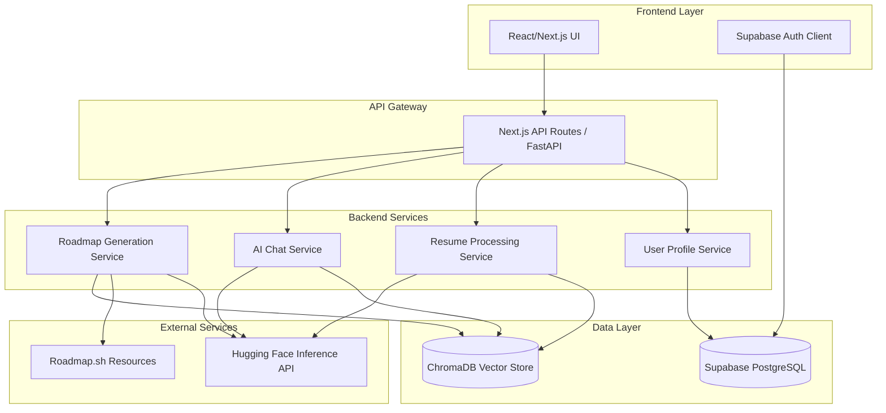

# Design Document

## Overview

Trajectory.AI is designed as a modern, scalable career navigation platform built with a microservices architecture. The system combines a React/Next.js frontend with a containerized backend that leverages AI/ML technologies for personalized career guidance. The platform uses a hybrid approach with Supabase for user data and authentication, ChromaDB for vector storage, and Hugging Face models for AI processing.

## Architecture

### High-Level Architecture



### Technology Stack

- **Frontend**: React 18 + Next.js 14 + Tailwind CSS
- **Backend**: FastAPI (Python) for AI/ML services, Next.js API routes for simple operations
- **Database**: Supabase (PostgreSQL) for relational data
- **Vector Database**: ChromaDB for embeddings and semantic search
- **Authentication**: Supabase Auth
- **AI/ML**: Hugging Face Inference API (Mistral-7B, Gemma, bge-small-en-v1.5)
- **Orchestration**: LangChain for AI workflow management
- **Containerization**: Docker + Kubernetes
- **Deployment**: Vercel (frontend), GKE/Minikube (backend services)

## Components and Interfaces

### Frontend Components

#### 1. Authentication Flow
- **LoginPage**: Supabase email/password authentication
- **SignupPage**: User registration with email verification
- **AuthGuard**: Route protection component

#### 2. Onboarding Flow
- **ProfileSetupForm**: Collects education, career background, and goals
- **ResumeUploadComponent**: PDF upload with drag-and-drop interface
- **OnboardingWizard**: Multi-step guided setup process

#### 3. Main Application
- **Dashboard**: Primary interface with chat and roadmap sections
- **ChatInterface**: Real-time AI mentor conversation
- **RoadmapViewer**: Interactive career roadmap display
- **ProfileEditor**: Edit user information and re-upload resume

#### 4. Shared Components
- **LoadingSpinner**: Consistent loading states
- **ErrorBoundary**: Error handling and user feedback
- **NavigationBar**: App navigation with user menu

### Backend Services

#### 1. User Profile Service
```python
class UserProfileService:
    def create_profile(user_id: str, profile_data: dict) -> Profile
    def get_profile(user_id: str) -> Profile
    def update_profile(user_id: str, updates: dict) -> Profile
    def delete_profile(user_id: str) -> bool
```

#### 2. Resume Processing Service
```python
class ResumeProcessingService:
    def upload_resume(user_id: str, file: bytes) -> str
    def parse_resume(file_path: str) -> dict
    def create_embeddings(text_chunks: list) -> list
    def store_embeddings(user_id: str, embeddings: list) -> bool
```

#### 3. AI Chat Service
```python
class AIChatService:
    def initialize_chat(user_id: str) -> ChatSession
    def send_message(session_id: str, message: str) -> str
    def get_chat_history(session_id: str) -> list
    def get_user_context(user_id: str) -> dict
```

#### 4. Roadmap Generation Service
```python
class RoadmapService:
    def generate_roadmap(user_id: str, current_role: str, target_role: str) -> Roadmap
    def get_learning_resources(skills: list) -> list
    def update_roadmap(roadmap_id: str, updates: dict) -> Roadmap
    def get_roadmap_progress(user_id: str) -> dict
```

## Data Models

### User Profile Model
```python
class Profile:
    id: str
    user_id: str  # Supabase Auth user ID
    education: dict
    career_background: str
    current_role: str
    target_roles: list[str]
    additional_details: str
    created_at: datetime
    updated_at: datetime
```

### Resume Model
```python
class Resume:
    id: str
    user_id: str
    file_path: str
    parsed_content: dict
    embedding_ids: list[str]  # References to ChromaDB
    upload_date: datetime
```

### Chat Session Model
```python
class ChatSession:
    id: str
    user_id: str
    messages: list[dict]
    context_version: str  # For tracking RAG context updates
    created_at: datetime
    last_activity: datetime
```

### Roadmap Model
```python
class Roadmap:
    id: str
    user_id: str
    current_role: str
    target_role: str
    phases: list[dict]
    estimated_timeline: str
    progress: dict
    created_at: datetime
    updated_at: datetime
```

### ChromaDB Collections
- **resume_embeddings**: User resume content chunks
- **knowledge_base**: Scraped learning resources and career information
- **conversation_memory**: Chat context and user interaction history

## Error Handling

### Frontend Error Handling
- **Network Errors**: Retry mechanism with exponential backoff
- **Authentication Errors**: Automatic redirect to login with clear messaging
- **Validation Errors**: Real-time form validation with user-friendly messages
- **File Upload Errors**: Progress indicators and error recovery options

### Backend Error Handling
- **AI Service Failures**: Fallback responses and graceful degradation
- **Database Connection Issues**: Connection pooling and retry logic
- **File Processing Errors**: Detailed error logging and user notification
- **Rate Limiting**: Queue management for Hugging Face API calls

### Error Response Format
```python
class ErrorResponse:
    error_code: str
    message: str
    details: dict
    timestamp: datetime
    request_id: str
```

## Testing Strategy

### Frontend Testing
- **Unit Tests**: Jest + React Testing Library for components
- **Integration Tests**: Cypress for user flow testing
- **Visual Regression**: Chromatic for UI consistency
- **Accessibility**: axe-core for WCAG compliance

### Backend Testing
- **Unit Tests**: pytest for service logic
- **Integration Tests**: FastAPI TestClient for API endpoints
- **AI Model Tests**: Mock Hugging Face responses for consistent testing
- **Database Tests**: Test containers for isolated database testing

### End-to-End Testing
- **User Journey Tests**: Complete onboarding to roadmap generation flow
- **Performance Tests**: Load testing for AI service endpoints
- **Security Tests**: Authentication and authorization validation

### Test Data Management
- **Synthetic Data**: Generated test profiles and resumes
- **Mock AI Responses**: Consistent AI model outputs for testing
- **Database Seeding**: Automated test data setup and teardown

## Performance Considerations

### Frontend Optimization
- **Code Splitting**: Route-based and component-based lazy loading
- **Image Optimization**: Next.js automatic image optimization
- **Caching**: SWR for API response caching
- **Bundle Analysis**: Regular bundle size monitoring

### Backend Optimization
- **Connection Pooling**: Database and ChromaDB connection management
- **Caching Strategy**: Redis for frequently accessed user data
- **Async Processing**: Background jobs for resume processing and embedding generation
- **Rate Limiting**: Intelligent queuing for Hugging Face API calls

### AI/ML Optimization
- **Embedding Caching**: Store and reuse embeddings for similar queries
- **Model Selection**: Choose appropriate model size based on query complexity
- **Batch Processing**: Group similar requests for efficiency
- **Context Management**: Optimize RAG context size for performance

## Security Considerations

### Authentication & Authorization
- **Supabase RLS**: Row-level security for data isolation
- **JWT Validation**: Secure token handling and refresh
- **Session Management**: Secure session storage and expiration

### Data Protection
- **File Upload Security**: Virus scanning and file type validation
- **Data Encryption**: Encrypt sensitive data at rest and in transit
- **PII Handling**: Anonymize and protect personally identifiable information

### API Security
- **Rate Limiting**: Prevent abuse of AI services
- **Input Validation**: Sanitize all user inputs
- **CORS Configuration**: Restrict cross-origin requests appropriately